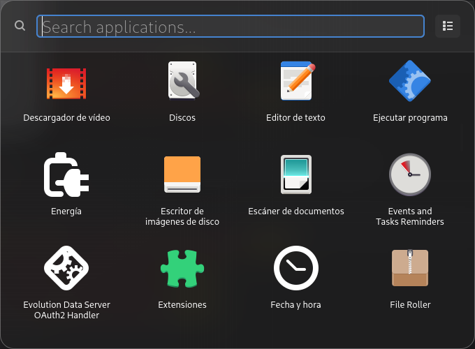

# Spotlight GTK

A standalone GTK4 application launcher for Linux with a liquid glass aesthetic, inspired by macOS Spotlight.

<p align="center">
  
</p>

## Key Features
- Native GTK4 and Libadwaita implementation.
- Liquid glass UI with transparency and blur.
- Search across system applications, Flatpaks, and Snaps.
- Persistent view preference (Grid or List mode).
- Frameless, always-on-top window with auto-hide on blur.

## Installation
Download the latest `.deb` package from the [Releases](https://github.com/your-username/spotlight/releases) section and install it:

```bash
sudo apt install ./spotlight-python.deb
```

Once installed, pin "Spotlight" to your dock or assign a global keyboard shortcut to `/usr/bin/spotlight-python`.

## Local Development
To run the application from source:

1. Install dependencies:
   ```bash
   pip install PyGObject libadwaita
   ```
2. Run the application:
   ```bash
   python3 spotlight-python/main.py
   ```

## Repository Structure
- `spotlight-python/`: Main stable version (Recommended).
- `src-tauri/`: Experimental Tauri 2 + Astro implementation.
- `.github/workflows/`: Automation for building and releasing `.deb` packages.
